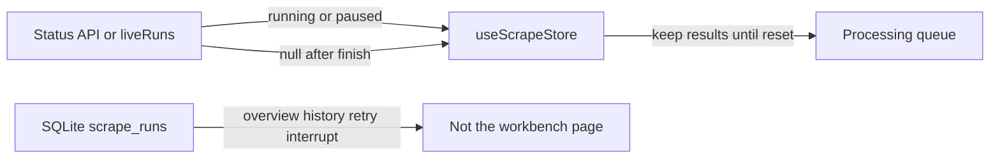

# 07 pass 1 — Live scrape UI ownership and workbench session

**Depends on:** [03-scrape-attempts-cancellation.md](d:/Develop/architecture-completion/03-scrape-attempts-cancellation.md) (`stopped` and `interrupted` exist), [05-shared-commit-boundary.md](d:/Develop/architecture-completion/05-shared-commit-boundary.md) (the coordinator owns in-process runs; SQLite owns history).

**Unblocks:** the rest of [07-client-state-sse-assets.md](d:/Develop/architecture-completion/07-client-state-sse-assets.md) — SSE subscribe-before-write, asset refs, a real scrape task schema, and webhook bounding. Those are not in this pass.

This document is written like 07 so it can sit in the same series. It is the **first** 07 pass: the “one live-scrape owner” work, plus the workbench behaviour we already agreed on.

## Context

Two different moments were treated as one, so the UI did the wrong thing in both.

**While this app launch is still open.** The user starts a scrape, watches the processing queue, and when it finishes they still need that list: open a title, check a poster, retry a failure. Leaving the queue should be an explicit “return to the workbench start page”.

**After the app is quit and opened again.** Clicking “Go to workbench” should be a new session: the start page, not last time’s queue. That is true for a fully successful scrape and for a scrape that had failures. The exception is a scrape that is **still running or paused** in this process — that is unfinished work, not history.

The desktop status API currently, when nothing is running, loads the **latest finished scrape from SQLite** and hands it to the UI. That was added when an in-memory “last snapshot” cache was deleted (shared-commit plan: stop keeping a second copy of live state in the scraper service). Using the database as a stand-in for that cache made **finished history look like the current workbench**. Reopening the app therefore opened the old queue.

The web client has the opposite bug: when the server says there are no in-process runs, the UI **clears** the queue, so results vanish the moment the scrape finishes — even though the user is still looking at the window.

SQLite scrape-run rows stay. They record what was scraped, support retry on the same run, feed the overview “last output” summary, mark killed runs as interrupted on startup, and sit next to the publication journal that repairs files after a crash. They must not be used as the workbench’s current page.

## Scope

### 1. The status API reports only a run that is still in this process

[`ScraperService.getSnapshot()`](apps/desktop/src/main/services/scraper/ScraperService.ts) today: if `liveRuns()` is empty, it reads `getLatestFinalized()` from SQLite (and then skips some successful runs). That path goes.

`getSnapshot()` returns the first in-process run, or `null`. IPC `scraper:get-status` stays; it just means “is anything running or paused here?”, not “what was the last job ever?”.

**Leave `getLatestFinalized()` in place.** It is still used by the overview ([`libraryService.ts`](apps/server/src/services/libraryService.ts)) and the desktop output-library summary ([`OutputLibraryScanner.ts`](apps/desktop/src/main/services/library/OutputLibraryScanner.ts)).

**Leave** startup `interruptUnfinished()`, `recoverPublications()`, `scrape.history`, and retry-on-the-same-run-id. Power loss is handled there, not by restoring the processing queue.

### 2. The scrape store keeps this window’s finished results

[`useScrapeStore`](packages/views/src/state/scrapeStore.ts) is the only client store for “the scrape this UI is showing”.

- While a run is queued, running, paused, or stopping, the store follows the status API / `liveRuns()`.
- When that API returns `null` because the run **just finished**, do **not** clear the store. Keep the last results until the user returns to the start page.
- When the renderer process starts, the store is empty. Combined with `getSnapshot() === null`, “Go to workbench” is the start page.

Remove the filter that hides a finished scrape unless it has failures (`snapshotHasWorkbenchFollowUp`). That was the mistaken “go back to setup as soon as scraping succeeds”.

Remove `hiddenRunId`, `selection`, and `clearVisibleResults`. They only existed to hide a queue that the host kept pushing back from SQLite. After step 1 the host no longer does that.

Returning to the start page, clearing the result list, starting a new scrape, and the matching shortcut all call `reset()` (optionally then `setPending(true)` when a new scrape is about to start). Keep [`useWorkbenchTaskStore.reset()`](packages/views/src/state/workbenchTaskStore.ts) — it has real callers.

Desktop [`useIpcSync.ts`](apps/desktop/src/renderer/src/hooks/useIpcSync.ts): a `null` status means no in-process run, not “wipe the session”.

Web [`taskHydration.ts`](apps/web/src/taskHydration.ts) `applyScrapeLiveRunsSnapshot`: when `liveRuns()` is empty, do not call `setSnapshot(null)` if this session still has finished results.

### 3. Stop duplicating scrape fields on the workbench task store

This is the store cleanup in [07-client-state-sse-assets.md](d:/Develop/architecture-completion/07-client-state-sse-assets.md) (“One live-scrape owner”), done in this pass so we do not keep a second scrape copy.

[`workbenchTaskStore.ts`](packages/views/src/state/workbenchTaskStore.ts) currently copies scrape ids and snapshots that nothing reads, or that the scrape store already has.

Keep on the workbench task store only UI-only scrape-adjacent state: pending uncensored confirmation (`uncensoredTaskId`, `ambiguousUncensoredItems`, `shouldOpenUncensoredDialog`). Read the active maintenance session id from the maintenance store instead of storing it again.

**Delete these fields** (written, never read, or duplicated): `liveScrapeRunsById`, `latestScrapeStage`, `latestTaskFailure`, `activeScrapeTaskId`. Writers are in [`taskHydration.ts`](apps/web/src/taskHydration.ts).

**Delete these actions** (no callers outside the store file): `updateHydrationState`, `setActiveScrapeTaskId`, `resolveUncensoredTask`.

Replace the three readers of `activeScrapeTaskId` with a selector on the scrape store, e.g. current snapshot task id or `""`:

- [`apps/web/src/adapters/ports.ts`](apps/web/src/adapters/ports.ts) (retry)
- [`apps/web/src/routes/logs.tsx`](apps/web/src/routes/logs.tsx)
- [`apps/web/src/routes/workbench.tsx`](apps/web/src/routes/workbench.tsx)

Keep `selectActiveLiveScrapeRun` in `taskHydration.ts`. When it needs “which run were we showing?”, read the scrape store, not the deleted hydration field.

### 4. Retry after the run has finished still uses this session’s id

[`retryScrapeSelection`](apps/desktop/src/renderer/src/api/manual.ts) currently calls `getStatus()` to learn the run id. After step 1, `getStatus()` is `null` once the scrape has finished, so “Retry failed” in the same window would break.

Read the run id from `useScrapeStore` (same selector as the web ports). The main-process `scrapeRuns.retry()` method does not change.

## Deletions

- Latest-finished-run fallback inside `getSnapshot()` — [`ScraperService.ts`](apps/desktop/src/main/services/scraper/ScraperService.ts) (keep `getLatestFinalized()` itself)
- Hide-unless-failure logic — `snapshotHasWorkbenchFollowUp` / `LIVE_TASK_STATUSES` in [`scrapeStore.ts`](packages/views/src/state/scrapeStore.ts)
- `hiddenRunId`, `selection`, `clearVisibleResults` — same file and their call sites
- `liveScrapeRunsById`, `latestScrapeStage`, `latestTaskFailure`, `activeScrapeTaskId` — [`workbenchTaskStore.ts`](packages/views/src/state/workbenchTaskStore.ts)
- Writers of those fields — [`taskHydration.ts`](apps/web/src/taskHydration.ts)
- `updateHydrationState`, `setActiveScrapeTaskId`, `resolveUncensoredTask` — workbench task store

**Do not delete** `useWorkbenchTaskStore.reset()`.

**Do not delete** SQLite scrape runs, attempts, outcomes, `interruptUnfinished`, or publication-journal recovery.

## Out of this pass (later 07)

- SSE: subscribe before writing the stream; drop event ids; refetch logs on reconnect
- Emit remote image/trailer refs only when config allows and there is no local file
- A scrape-specific task schema so the UI can show `stopped` and `interrupted` instead of mapping them to `failed`
- Webhook delivery-phase map bounding

## Verification

**Tests to author**

Selector over the scrape store:

- No run in the store → empty id (fresh window / after reset)
- Running or paused snapshot → that task id
- Finished snapshot still in the store → that task id (same window, scrape already done)

[`apps/web/src/adapters/ports.test.ts`](apps/web/src/adapters/ports.test.ts) still passes with `reset()` intact.

`getSnapshot`:

- No in-process run → `null`, whether the last SQLite run succeeded or failed
- A paused or running in-process run → that run

Workbench session:

- After a scrape completes in this window, the processing queue is still shown
- After “return to start page”, the start page stays even if status is refreshed with `null`
- A new renderer with empty store and `null` status shows the start page
- Retry failed in this window still uses the same run id

**Manual**

1. Run a scrape, wait until it finishes, open a row’s detail. The queue must still be there.
2. Confirm return to the workbench start page. Stay there.
3. Quit and reopen. “Go to workbench” is the start page after a successful scrape and after a failed scrape.
4. Pause a scrape, quit, reopen (if the process was still up) or start a scrape, pause, and confirm the queue is the paused run — not a finished job from last week.
5. Retry a failed item in the same window after the batch has finished.
